# CNCF 技术栈自由实践博客 

## 个人信息

| 课程名称 |  服务计算   |   任课老师   |      潘茂林      |
| :------: | :---------: | :----------: | :--------------: |
|   年级   |   2018级    | 专业（方向） |   软件工程专业   |
|   学号   |  18342025   |     姓名     |      胡鹏飞      |
|   电话   | 13944589695 |    Email     | 945554668@qq.com |

## gRPC 介绍

`gRPC` 是一个高性能、开源和通用的 RPC 框架，面向移动和 HTTP/2 设计。目前提供 C、Java 和 Go 语言版本，分别是：grpc, grpc-java, grpc-go. 其中 C 版本支持 C, C++, Node.js, Python, Ruby, Objective-C, PHP 和 C# 支持.

gRPC 基于 HTTP/2 标准设计，带来诸如双向流、流控、头部压缩、单 TCP 连接上的多复用请求等特。这些特性使得其在移动设备上表现更好，更省电和节省空间占用。

## 实验环境

**操作系统**：`Ubuntu 20.04`

## 安装依赖

- 安装 `pkg-config` 

  `sudo apt-get install pkg-config`

  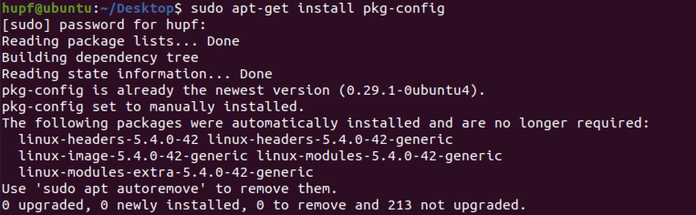

- 安装依赖文件 

  ```bash
  sudo apt-get install autoconf automake libtool make g++ unzip 
  sudo apt-get install libgflags-dev libgtest-dev 
  sudo apt-get install clang libc++-dev 
  ```

  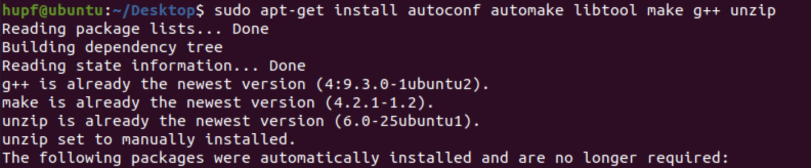

  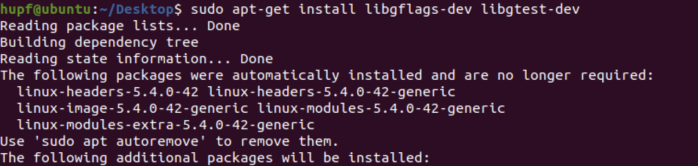

  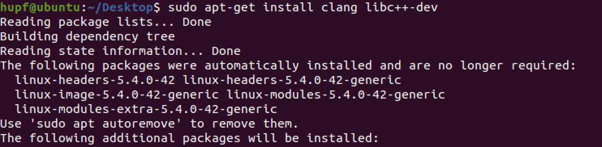

- 下载 `gRPC` 源码 

  ```bash
  git clone https://github.com/grpc/grpc.git 
  ```

  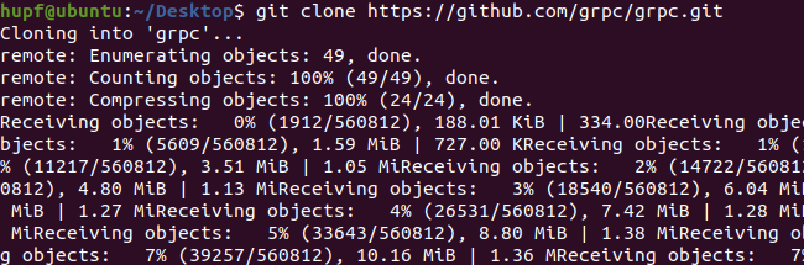

- 更新第三方源码

  ```bash
  cd grpc 
  git submodule update --init
  ```

  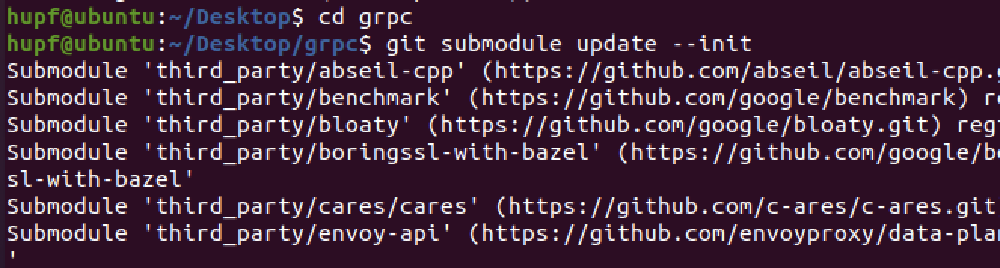

- 安装 `protobuf`；此时应保证在 `grpc` 文件夹下

  `cd third_party/protobuf/`

  确保克隆子模块，更新第三方源码

  `git submodule update --init --recursive`  

  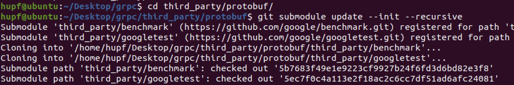

- 生成配置脚本

  `sudo ./autogen.sh`  

  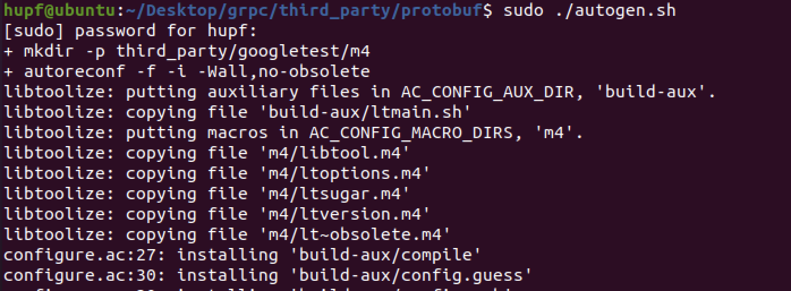

- 生成 `Makefile` 文件，为下一步的编译做准备，可以加上安装路径：`--prefix=path` ，默认路径为 `/usr/local/ `

  `sudo ./configure`   

  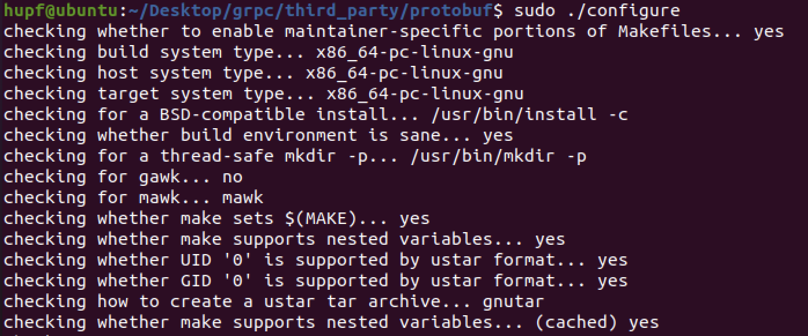

- 从 `Makefile` 读取指令，然后编译

   `sudo make`         

   

- 可能会报错，但是不影响，对于安装流程没有实质性用处，可以跳过该步

  `sudo make check`     

  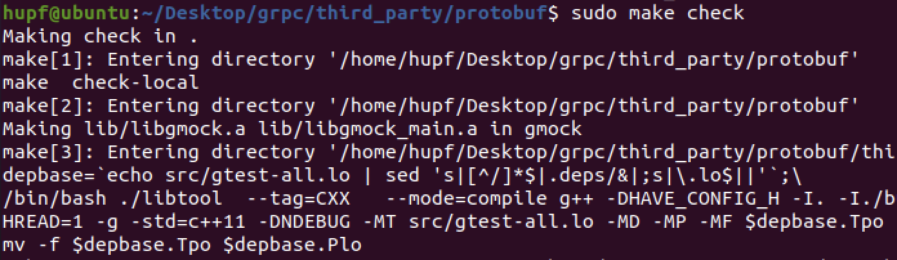

- 更新共享库缓存

  `sudo make install`

  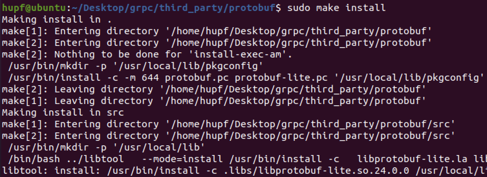

  `sudo ldconfig`    

  

- 查看软件的安装位置

  `which protoc`         

  

- 检查是否安装成功

  `protoc --version`   

  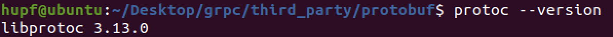

- 安装 `gRPC` 到达 `grpc` 根文件夹下，然后进行编译

  ```bash
  cd ../..
  make
  ```

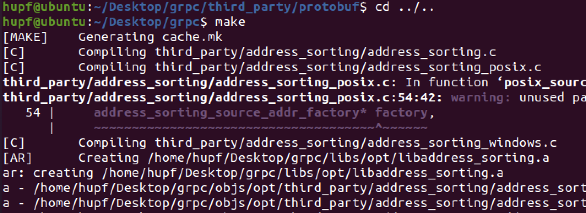

## 实验过程

`gRPC` 通常用来编写服务端代码、客户端代码、通过 `protobuf` 来定义接口和数据类型

以 `helloworld` 举例，使用 `protoc` 命令生成相关文件

`protoc --go_out=plugins=grpc:. helloworld.proto`

在这里 `plugins` 选项选择 `grpc`，生成相应的服务接口。

- 服务器端：

  ```go
  package main
   
  import (
      "log"
      "net"
   
      pb "your_path_to_gen_pb_dir/helloworld"
      "golang.org/x/net/context"
      "google.golang.org/grpc"
  )
   
  const (
      port = ":8082"
  )
   
  type server struct{}
   
  func (s *server) SayHello(ctx context.Context, in *pb.HelloRequest) (*pb.HelloReply, error) {
      return &pb.HelloReply{Message: "Hello " + in.Name}, nil
  }
   
  func main() {
      lis, err := net.Listen("tcp", port)
      if err != nil {
          log.Fatalf("failed to listen: %v", err)
      }
      s := grpc.NewServer()
      pb.RegisterGreeterServer(s, &server{})
      s.Serve(lis)
  }
  ```

- 客户端：

  ```go
  package main
   
  import (
      "log"
      "os"
   
      pb "your_path_to_gen_pb_dir/helloworld"
      "golang.org/x/net/context"
      "google.golang.org/grpc"
  )
   
  const (
      address     = "localhost:8082"
      defaultName = "world"
  )
   
  func main() {
      conn, err := grpc.Dial(address, grpc.WithInsecure())
      if err != nil {
          log.Fatalf("did not connect: %v", err)
      }
      defer conn.Close()
      
      c := pb.NewGreeterClient(conn)
   
      name := defaultName
      if len(os.Args) > 1 {
          name = os.Args[1]
      }
      r, err := c.SayHello(context.Background(), &pb.HelloRequest{Name: name})
      if err != nil {
          log.Fatalf("could not greet: %v", err)
      }
      log.Printf("Greeting: %s", r.Message)
  }
  ```

## 实验结果

先运行服务器端在运行客户端：

```bash
go run server/server.go
go run client/client.go
```

得到的结果如下所示：


可以看到运行成功，实验成功实现