# 部署 Kubernetes(选做)

## 个人信息

| 课程名称 | 服务计算    | 任课老师     | 潘茂林                                      |
| -------- | ----------- | ------------ | ------------------------------------------- |
| 年级     | 2018级      | 专业（方向） | 软件工程专业                                |
| 学号     | 18342025    | 姓名         | 胡鹏飞                                      |
| 电话     | 13944589695 | Email        | [945554668@qq.com](mailto:945554668@qq.com) |

## 博客地址

[部署中遇到的问题]()

## 前言

本次作业我在 `Mac OS` 和 `CentOS` 两个操作系统都有部署 `Kubernetes`，下面我会分别讲一下部署的详细过程

## Mac OS 部署 Kubernetes

### 实验环境

**操作系统**：MacOS Big Sur 11.0.1

### 说明

`Docker Desktop` 可以方便的启用 `Kubernetes` 集群, 为学习 `Kubernetes` 提供了极大的便利, 但是由于众所周知的原因, 国内的网络下不能很方便的下载 `Kubernetes` 集群所需要的镜像, 导致集群启用失败. 这里提供了一个简单的方法, 利用 [GitHub Actions](https://developer.github.com/actions/creating-github-actions/) 实现 `k8s.gcr.io` 上 `kubernetes` 依赖镜像自动同步到 [Docker Hub](https://hub.docker.com/) 上指定的仓库中。 通过 [load_images.sh](https://github.com/gotok8s/k8s-docker-desktop-for-mac/blob/master/load_images.sh) 将所需镜像从 `Docker Hub` 的同步仓库中取回，并重新打上原始的`tag`. 镜像对应关系文件可以查看: [images](https://github.com/gotok8s/k8s-docker-desktop-for-mac/blob/master/images).

### 安装

首先需要下载好 `Docker Desktop`，该软件在官网中下载速度较慢直接点击以下链接即可快速下载：

[Docker Desktop](https://download.docker.com/mac/edge/Docker.dmg)

安装好之后，从 `Docker Hub` 的同步仓库中取回，并重新打上原始的 `tag`.

`./load_images.sh`

需要在 `Docker for Mac` 设置中启用 `Kubernetes` 选项，如果是第一次启动的话会让我们选择安装 `Kubernetes` ，并且左下角为：

成功安装后点击右侧的按钮即可启用  `Kubernetes`  选项

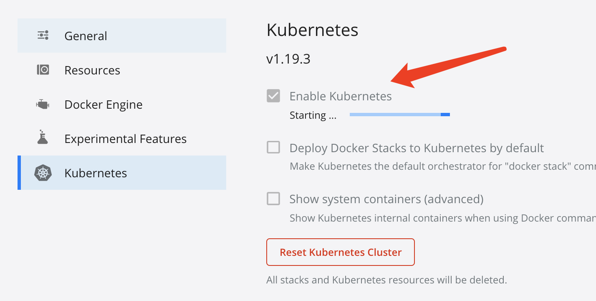

这样就可以成功开启了：

等待一会  `Kubernetes` 就可以正常运行

## CentOS 部署 Kubernetes

### 实验环境

**操作系统**：`CentOS 8 64位`

### 部署过程

#### 说明

部署 `Kubernetes` 的步骤都是按照老师推荐的博客中的步骤进行的：

[传送门](https://www.kubernetes.org.cn/7189.html)

#### 系统准备

查看系统版本：

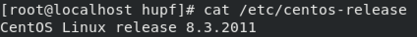

配置网络：

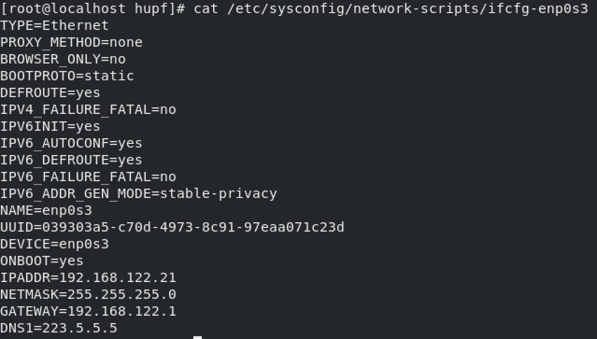

添加阿里源：

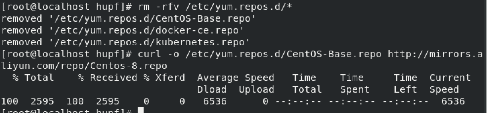

配置主机名：

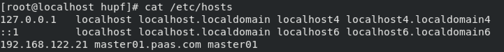

关闭 `swap`，注释 `swap` 分区：

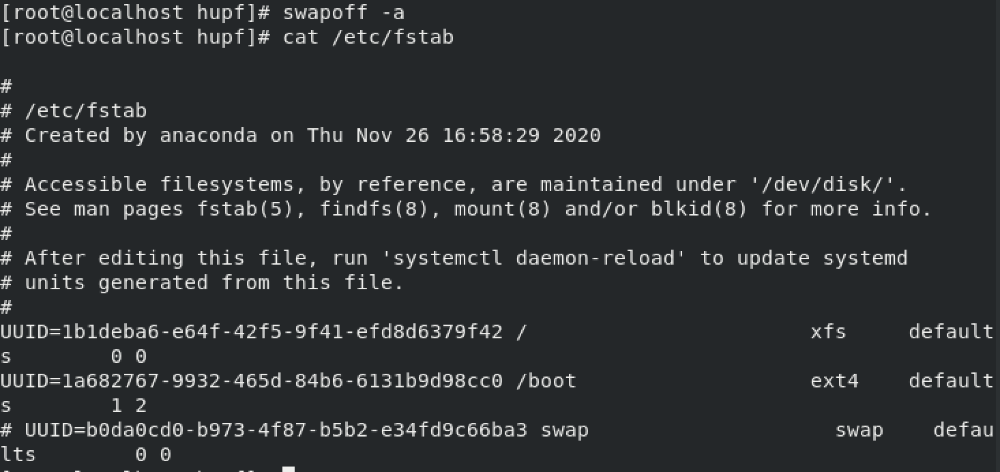

配置内核参数，将桥接的 `IPv4` 流量传递到 `iptables` 的链：

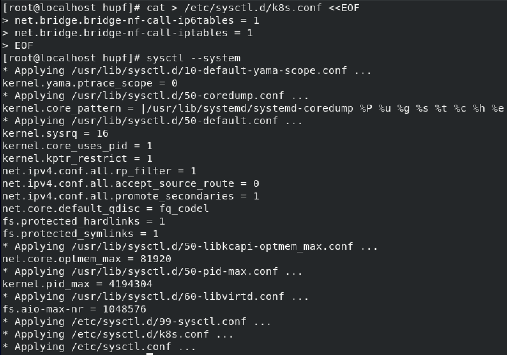

#### 安装常用包

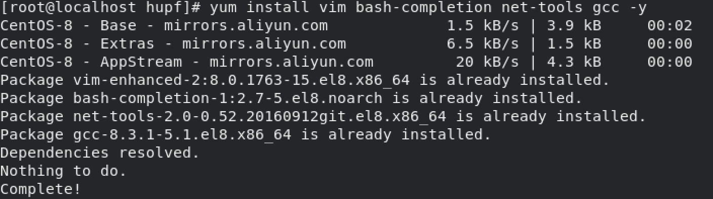

#### 使用aliyun源安装docker-ce

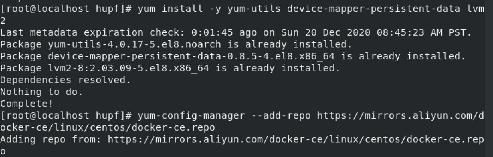

此时如果按照网页中的部署过程就会有报错：

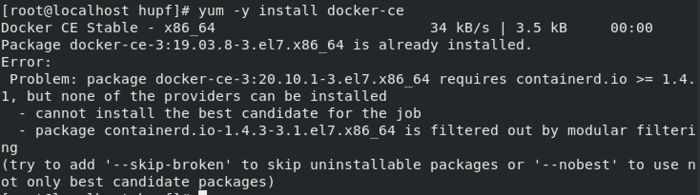

报错的信息大概是 `docker-ce` 的版本过高需要更高的 `containerd.io` 版本，然而网页中的解决方法根本不行，网页中让我们在安装表中下载相应的版本，可是下载列表中最高的版本也只有 1.3.7:

我的解决方法是安装低版本的 `docker-ce` 

首先通过命令获取可以下载的版本的列表：

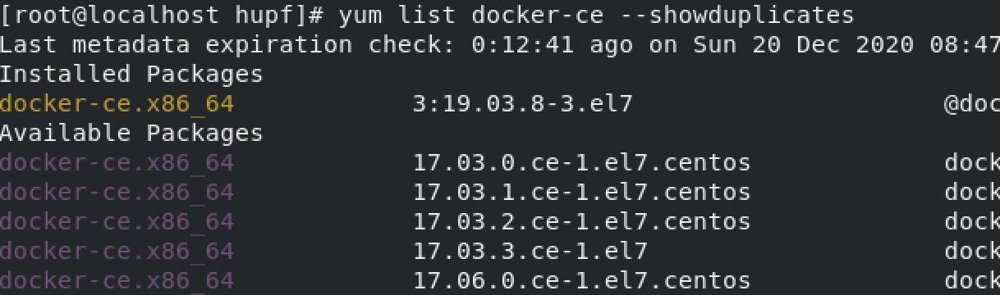

然后选择一个版本较低的下载即可

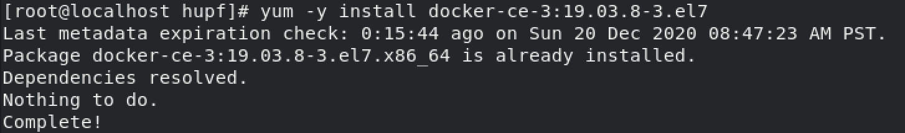

添加 `aliyundocker` 仓库加速器：

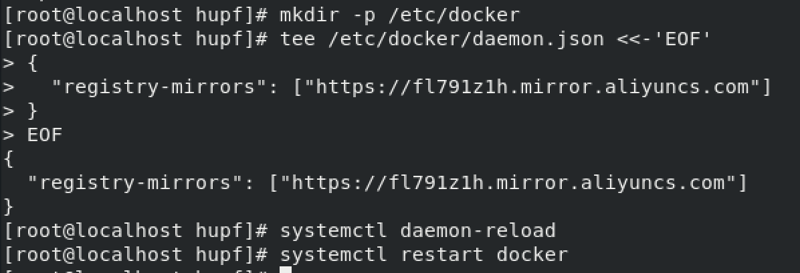