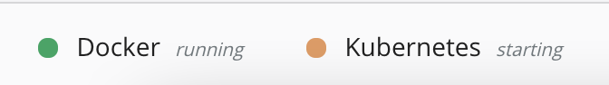

# 部署 Kubernetes(选做)

## 个人信息

| 课程名称 | 服务计算    | 任课老师     | 潘茂林                                      |
| -------- | ----------- | ------------ | ------------------------------------------- |
| 年级     | 2018级      | 专业（方向） | 软件工程专业                                |
| 学号     | 18342025    | 姓名         | 胡鹏飞                                      |
| 电话     | 13944589695 | Email        | [945554668@qq.com](mailto:945554668@qq.com) |

## 博客地址

[部署中遇到的问题]()

## 前言

本次作业我在 `Mac OS` 和 `CentOS` 两个操作系统都有部署 `Kubernetes`，下面我会分别讲一下部署的详细过程

## Mac OS 部署 Kubernetes

### 实验环境

**操作系统**：MacOS Big Sur 11.0.1

### 说明

`Docker Desktop` 可以方便的启用 `Kubernetes` 集群, 为学习 `Kubernetes` 提供了极大的便利, 但是由于众所周知的原因, 国内的网络下不能很方便的下载 `Kubernetes` 集群所需要的镜像, 导致集群启用失败. 这里提供了一个简单的方法, 利用 [GitHub Actions](https://developer.github.com/actions/creating-github-actions/) 实现 `k8s.gcr.io` 上 `kubernetes` 依赖镜像自动同步到 [Docker Hub](https://hub.docker.com/) 上指定的仓库中。 通过 [load_images.sh](https://github.com/gotok8s/k8s-docker-desktop-for-mac/blob/master/load_images.sh) 将所需镜像从 `Docker Hub` 的同步仓库中取回，并重新打上原始的`tag`. 镜像对应关系文件可以查看: [images](https://github.com/gotok8s/k8s-docker-desktop-for-mac/blob/master/images).

### 安装

首先需要下载好 `Docker Desktop`，该软件在官网中下载速度较慢直接点击以下链接即可快速下载：

[Docker Desktop](https://download.docker.com/mac/edge/Docker.dmg)

安装好之后，从 `Docker Hub` 的同步仓库中取回，并重新打上原始的 `tag`.

`./load_images.sh`

需要在 `Docker for Mac` 设置中启用 `Kubernetes` 选项，如果是第一次启动的话会让我们选择安装 `Kubernetes` ，并且左下角为：


成功安装后点击右侧的按钮即可启用  `Kubernetes`  选项


这样就可以成功开启了：



等待一会  `Kubernetes` 就可以正常运行

## CentOS 部署 Kubernetes

### 实验环境

**操作系统**：`CentOS 8 64位`

### 部署过程

#### 说明

部署 `Kubernetes` 的步骤都是按照老师推荐的博客中的步骤进行的：

[传送门](https://www.kubernetes.org.cn/7189.html)

#### 系统准备

查看系统版本：


配置网络：


添加阿里源：


配置主机名：


关闭 `swap`，注释 `swap` 分区：


配置内核参数，将桥接的 `IPv4` 流量传递到 `iptables` 的链：


#### 安装常用包


#### 使用aliyun源安装docker-ce


此时如果按照网页中的部署过程就会有报错：


报错的信息大概是 `docker-ce` 的版本过高需要更高的 `containerd.io` 版本，然而网页中的解决方法根本不行，网页中让我们在安装表中下载相应的版本，可是下载列表中最高的版本也只有 1.3.7:


我的解决方法是安装低版本的 `docker-ce` 

首先通过命令获取可以下载的版本的列表：


然后选择一个版本较低的下载即可


添加 `aliyundocker` 仓库加速器：


#### 安装kubectl、kubelet、kubeadm

添加阿里 `kubernetes` 源


安装


#### 初始化k8s集群

`POD` 的网段为: `10.122.0.0/16`， `api server` 地址就是 `master` 本机 `IP`。

这一步很关键，由于 `kubeadm` 默认从官网 `k8s.grc.io` 下载所需镜像，国内无法访问，因此需要通过 `–image-repository` 指定阿里云镜像仓库地址。

**注意**：此过程按照网页上的过程会出现问题，如下：


也是版本的问题，所以可以根据提示选择适合的版本，或者可以科学上网将后面的 `--kubernetes-version=1.18.0` 去掉即可

集群初始化成功后返回如下信息：


记录生成的最后部分内容，此内容需要在其它节点加入 `Kubernetes` 集群时执行。
根据提示创建 `kubectl`：


执行下面命令，使 `kubectl` 可以自动补充


查看节点，`pod`：

```
# kubectl get node
NAME     STATUS     ROLES    AGE   VERSION
master   NotReady   master   16m   v1.18.2
# kubectl get pod --all-namespaces
NAMESPACE     NAME                             READY   STATUS    RESTARTS   AGE
kube-system   coredns-7ff77c879f-j6mx7         0/1     Pending   0          15m
kube-system   coredns-7ff77c879f-n9jlv         0/1     Pending   0          15m
kube-system   etcd-master                      1/1     Running   1          15m
kube-system   kube-apiserver-master            1/1     Running   1          15m
kube-system   kube-controller-manager-master   1/1     Running   1          15m
kube-system   kube-proxy-bc2h7                 1/1     Running   0          15m
kube-system   kube-scheduler-master            1/1     Running   1          15m
```

`node` 节点为 `NotReady` ，因为 `corednspod` 没有启动，缺少网络 `pod`

#### 安装calico网络


此时集群状态变为正常

#### 安装kubernetes-dashboard

官方部署 `dashboard` 的服务没使用 `nodeport` ，将` yaml` 文件下载到本地，在 `service` 里添加 `nodeport`：


查看 `pod`，`service`：

```
NAME                                        READY   STATUS    RESTARTS   AGE
dashboard-metrics-scraper-dc6947fbf-869kf   1/1     Running   0          37s
kubernetes-dashboard-5d4dc8b976-sdxxt       1/1     Running   0          37s

NAME                        TYPE        CLUSTER-IP     EXTERNAL-IP   PORT(S)         AGE
dashboard-metrics-scraper   ClusterIP   10.10.58.93    <none>        8000/TCP        44s
kubernetes-dashboard        NodePort    10.10.132.66   <none>        443:30000/TCP   44s
```

此时集群状态已经完全正常

通过页面访问：https://192.168.1.12:30000/#/login


登录需要使用 `token`：

- 创建 `token`

  `kubectl create sa dashboard-admin -n kube-system`

- 授权 `token` 访问权限

  `*kubectl create clusterrolebinding dashboard-admin --clusterrole=cluster-admin --serviceaccount=kube-system:dashboard-admin*`

- 取 `token`

  `*ADMIN_SECRET=$(kubectl get secrets -n kube-system | grep dashboard-admin | awk '{print $1}')*`

- 获取 `dashboard.kubeconfig` 使用 `token` 值

  ```
  [root@master src]# DASHBOARD_LOGIN_TOKEN=$(kubectl describe secret -n kube-system ${ADMIN_SECRET} | grep -E '^token' | awk '{print $2}')
  ```

- 登录之后的页面：

  

至此部署完成