# Docker 实践报告

## 个人信息

| 课程名称 |  服务计算   |   任课老师   |      潘茂林      |
| :------: | :---------: | :----------: | :--------------: |
|   年级   |   2018级    | 专业（方向） |   软件工程专业   |
|   学号   |  18342025   |     姓名     |      胡鹏飞      |
|   电话   | 13944589695 |    Email     | 945554668@qq.com |

## Docker 介绍

Docker 是一个开源的应用容器引擎，基于 Go 语言并遵从 Apache2.0 协议开源。

Docker 可以让开发者打包他们的应用以及依赖包到一个轻量级、可移植的容器中，然后发布到任何流行的 Linux 机器上，也可以实现虚拟化。

容器是完全使用沙箱机制，相互之间不会有任何接口（类似 iPhone 的 app）,更重要的是容器性能开销极低。

## Docker 优势

- 灵活:即使是最复杂的应用也可以容器化。

- 轻量:容器是进程，能利用并共享主机操作系统内核。

- 替换:可以即时部署更新和升级容器。
- 便携:可以在本地构建，部署到云并在任何地方运行。
- 扩展:您可以增加并自动分发容器副本。
- 组合:您可以自由地组合(stack)服务。

## 实验环境

**操作系统**：`Ubuntu 64 位 20.04.1`

**Docker 版本**：`17.03.2-ce`

## 实践过程

### 查看是否安装 Docker

首先检查自己的操作系统中是否装有 `docker`，直接在命令行中输入 `docker` 即可，如果存在以下提示说明没有安装

### 准备 Docker 环境

首先需要安装 `docker`；由于课件中写到在 `Linux` 中版本号很重要所以我选择了安装指定版本的 `docker`；如果直接按照系统提示的安装会安装最新版，所以安装指定版本需要执行以下命令：

```bash
sudo apt-get update
sudo apt-get install apt-transport-https ca-certificates curl software-properties-common
curl -fsSL https://download.docker.com/linux/ubuntu/gpg | sudo apt-key add -
sudo add-apt-repository "deb [arch=amd64] https://download.docker.com/linux/ubuntu xenial stable"
```

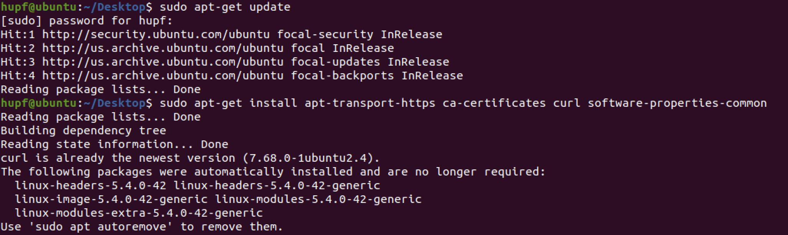

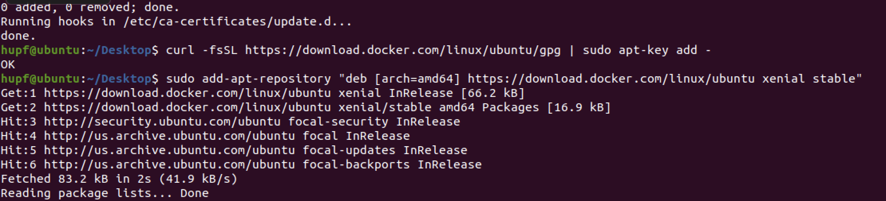

配置好上方的环境后通过以下命令即可查看可以安装的 `docker` 版本：

`apt-cache madison docker-ce`

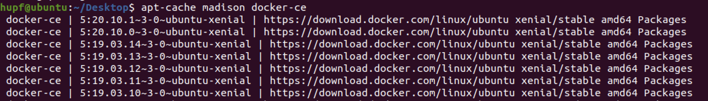

然后找到老师推荐的版本 `社区版 17.03.2 ce`

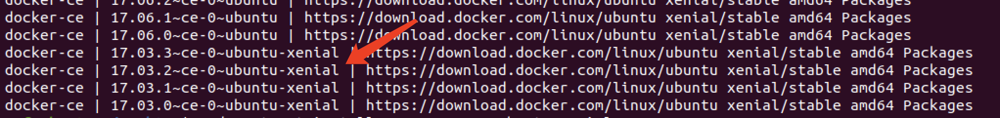

找到之后即可在输入命令进行安装指定的版本：

`sudo apt-get install docker-ce=17.03.2~ce-0~ubuntu-xenial`

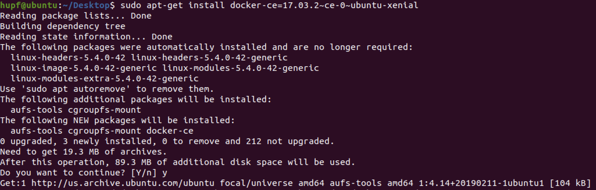

安装成功后就可以查看版本号：

`docker version`

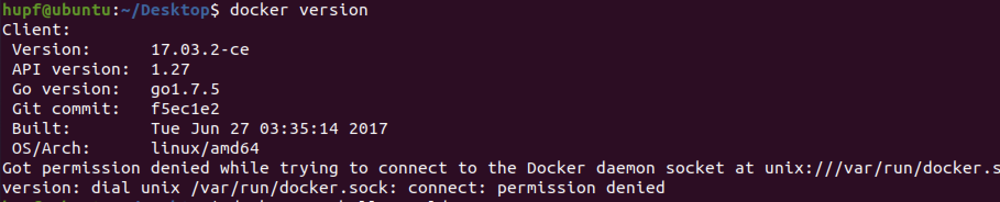

可以看到版本号是正确的但是缺少服务端有报错信息，同样地拉取 `hello-world` 镜像也会有同样问题

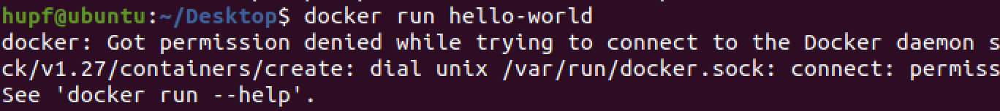

所以需要添加 `docker` 用户组，用以下的命令即可：

```bash
sudo groupadd docker          #添加docker用户组
sudo gpasswd -a $XXX docker   #检测当前用户是否已经在docker用户组中，其中XXX为用户名，例如我的，liangll
sudo gpasswd -a $USER docker  #将当前用户添加至docker用户组
newgrp docker                 #更新docker用户组
```

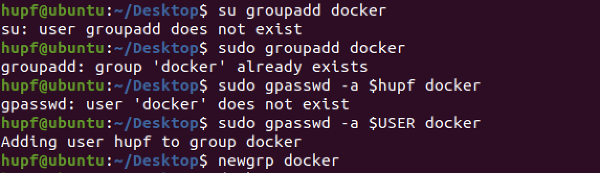

成功配置好后，再次输入命令：

`docker version`


### 运行第一个容器

运行最简单的镜像 `hello-world`：

`docker run hello-world` 

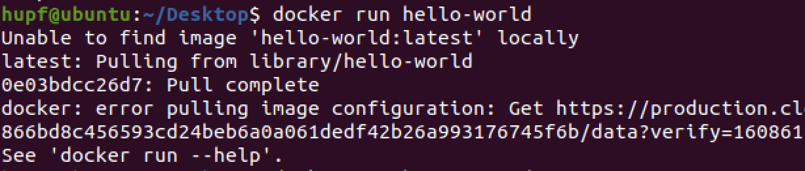

可以看到虽然解决了之前的问题，但是还是会出现如下的拉取失败的问题，解决方法也是比较简单：首先进入到 `root` 用户下（这样才能修改系统文件）然后在 `/etc/resolv.conf` 文件中新增一个参数:


加完之后返回到自己的用户下重启 `docker`，再次 `pull` 就能够下载成功了

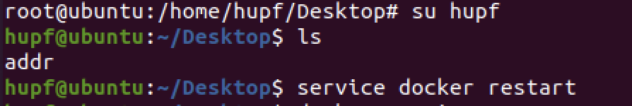


### Docker 基本操作

- 运行镜像：

  在运行下面命令之前需要进行配置镜像加速器，要不然下载的速度很慢，直接在阿里云官网上注册得到自己的加速地址，输入一下的命令即可：

  ```bash
  sudo mkdir -p /etc/docker
  sudo tee /etc/docker/daemon.json <<-'EOF'
  {
    "registry-mirrors": ["https://ou90lcbx.mirror.aliyuncs.com"]
  }
  EOF
  sudo systemctl daemon-reload
  sudo systemctl restart docker
  ```

  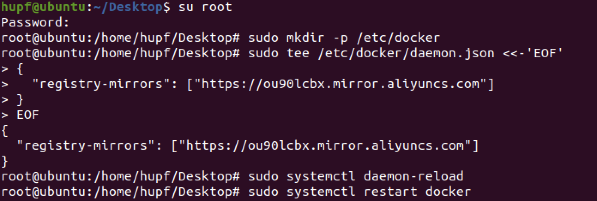

`docker run -it ubuntu bash`

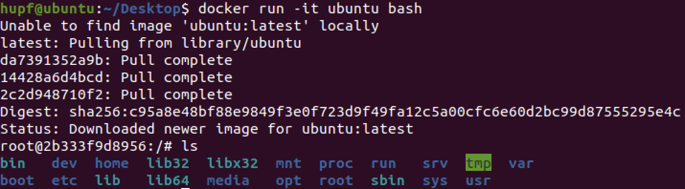

> -it 参数，通过终端与进程(容器)交互，stdin，stdout，stderr定向到 TTY

显示本地镜像库内容：

`docker images`

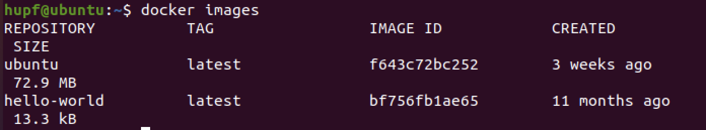

- 获得帮助

`docker --help`

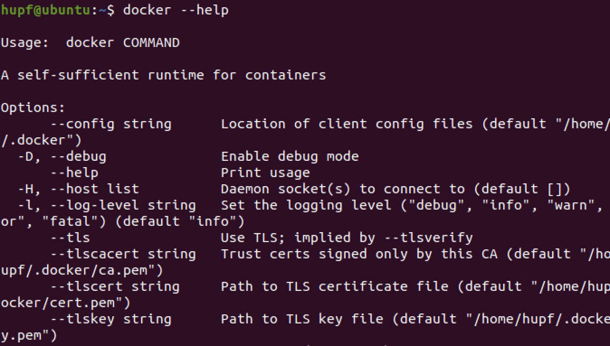

> – 基本选项
>
> – 管理命令(至少掌握container，image，network，volume)
>
> – 常用命令
>
> - 例如:docker images 等价于 docker image ls
> - 例如:docker ps 等价于 docker container ls

- 显示运行中容器

  `docker ps`

  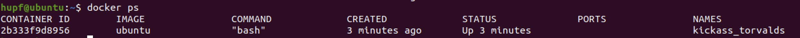

- 显示所有容器（包含已中止）

  `docker ps -a`

  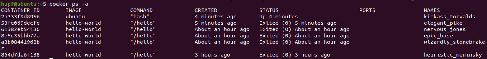

- 继续运行原容器并进入

  ```bash
  docker restart kickass_torvalds
  docker ps
  docker attach kickass_torvalds
  ```

  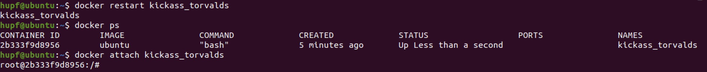

### MySQL 与容器化

- 拉起 `MySQL` 镜像

  `docker pull mysql:5.7`

  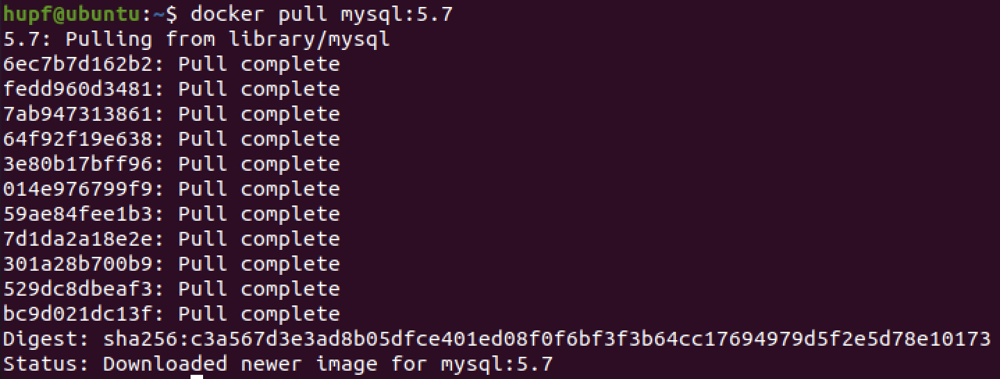

  拉取成功后进行检验 `docker images`

  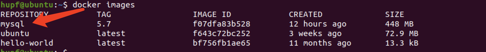

  > –  Repository: mysql
  >
  > –  Tag: 5.7
  >
  > –  Image ID: ae6b78bedf88

- 远程仓库

  > –  官方仓库: https://hub.docker.com/_/mysql/
  >
  > –  格式:https://registry/user/repo
  >
  > –  仓库中保存若干版本镜像，每个镜像对应一个 tag
  >
  > ​		默认的 tag 是 lastest
  > –  每个镜像有 github 上 Dockfile 生成

- `Dockerfile` 常见指令（按指令出现的顺序）

  - `FROM base_image`
  - `RUN shell_commands`
  - `ENV env_vars`
  - `VOLUME path`
  - `COPY sourcedestination`
  - `ENTRYPOINT [“executable”,”parm1”,”parm2”,...] – EXPOSEports`
  - `CMD [“executable”,”parm1”,”parm2”,...]`

- 构建 `docker` 镜像练习

  - 创建 `dockerfile` 文件

    ```bash
    mkdir mydock && cd mydock
    vi dockerfile
    ```

    

  - 录入以下内容

    ```
    FROM ubuntu
    ENTRYPOINT ["top", "-b"]
    CMD ["-c"]
    ```

    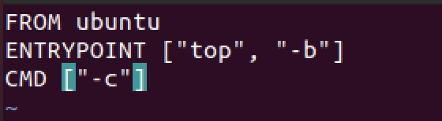

  - 构建镜像

    `docker build . -t hello`

    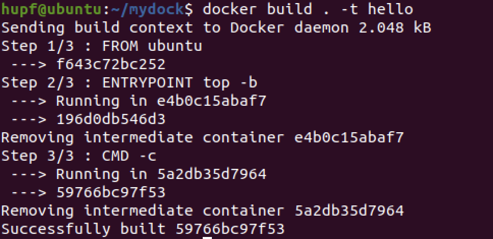

  - 运行镜像

    `docker run -it --rm hello -H`

    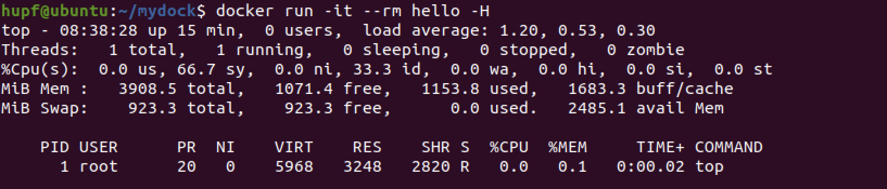

    可以看到成功运行；也可以通过命令 `docker ps` 进行检验：

    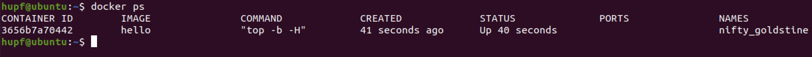

- 使用 `MySQL` 容器

  - 启动服务器

    `sudo docker run -p 3306:3306 --name mysql2 -e MYSQL_ROOT_PASSWORD=root -d mysql:5.7`

    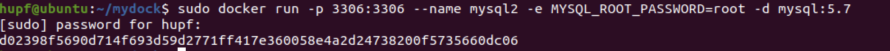

    `docker ps` 来检验是否成功启动

    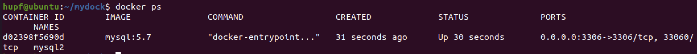

    由上图可知成功启动

  - 启动 `MySQL` 客户端

    `docker run -it --net host mysql:5.7 "sh"`

    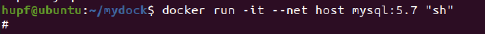

    通过 `docker ps` 来检验是否启动成功

    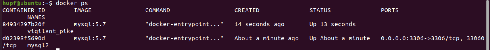

    由上图可知成功启动

- 使用 `MySQL` 容器(挂载卷保存`db`)

  - 数据库文件在哪里?

    `docker exec -it mysql2 bash`

    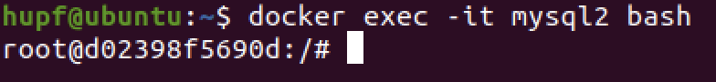

  - `Dockerfile` 的 `VOLUME /var/lib/mysql` 的含义

    ```bash
    docker container prune -f
    docker volume prune
    docker volume ls
    ```

    

  > 每次启动 mysql 容器，docker 创建一个文件卷挂载在容器内/var/lib/mysql位置
  >
  > 这个卷在主机(host)的 /var/lib/docker/volumes/ 目录下

- 创建卷并且挂载

  ```bash
  docker rm $(docker ps -a -q) -f -v
  docker volume create mydb
  docker run --name mysql2 -e MYSQL_ROOT_PASSWORD=root -v mydb:/var/lib/mysql -d mysql:5.7
  ```

  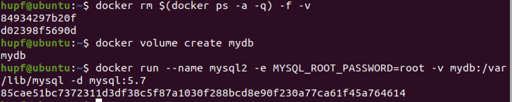

  > 注意:这里没有暴露端口到主机!
  > 将自己定义的数据卷挂载在/var/lib/mysql

- 启动客户端容器链接服务器

  `docker run --name myclient --link mysql2:mysql -it mysql:5.7 bash`

  

  > 注意:这里使用了--link连接两个容器
  >
  > 客户端容器内可以使用mysql这个别名访问服务器

- 挂载现有数据库

  `docker run -v "$PWD/data":/var/lib/mysql --user 1000:1000 --name`

- 修改容器配置

  `docker run --name some-mysql -v /my/custom:/etc/mysql/conf.d -e`

- `Docker compose` 与多容器应用自动化部署

  - 下载:`docker-compose`(容器编排的原型)

  - 编写:`stack.yml`

  - 启动服务

    ```bash
    mkdir comptest && cd comptest
    vi stack.yml
    
    version: '3.1'
    services:
    db:
    image: mysql:5.7
    command: --default-authentication-plugin=mysql_native_password restart: always
    environment:
    MYSQL_ROOT_PASSWORD: example adminer:
    image: adminer restart: always ports:
    - 8080:8080
    
    docker-compose -f stack.yml up
    ```

### Docker 网络

- 容器默认使用网络

  - `Docker0` (桥接)

- 容器支持网络与类型

  - `bridge` (本机内网络)
  - `host` (主机网卡)
  - `overlay` (跨主机网络)
  - `none`
  - `Custom` (网络插件)

- 管理容器网络

  `docker network ls`

  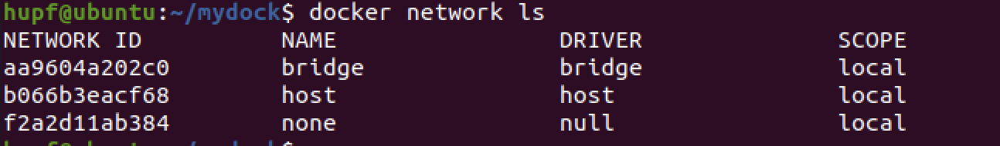

  >**注意**:docker-compose为每个应用建立自己的网络。

- 备制支持 `ifconfig` 和 `ping` 命令的 `ubuntu` 容器

  `docker run --name unet -it --rm ubuntu bash`

  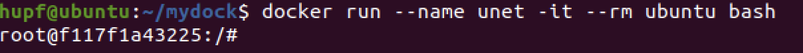

- 启动另一个命令窗口，由容器制作镜像

  ` docker commit unet ubuntu:net`

  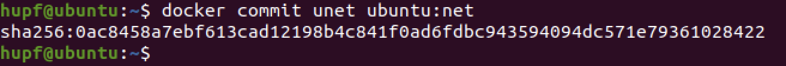

- Docker 默认网络

  - 容器通过桥(`docker0`)相连
  - `IP-Forward` 通过 `NAT` 访问外面
  - 端口映射使外面访问容器

- 创建自定义网络

  `docker network create mynet`

  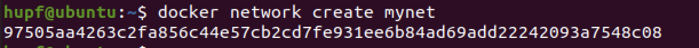

- 在两个窗口创建`u1,u2` 容器网络，并使用以下命令

  ```bash
  docker run --name u1 -it -p 8080:80 --net mynet --rm ubuntu:net bash 
  docker run --name u2 --net mynet -it --rm ubuntu:net bash
  docker inspect u1
  docker network connect bridge u1
  docker network disconnect mynet u1
  ```

  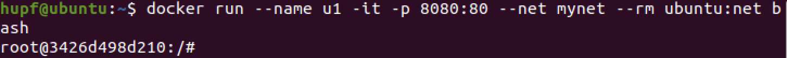

  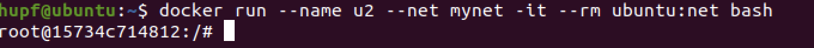

  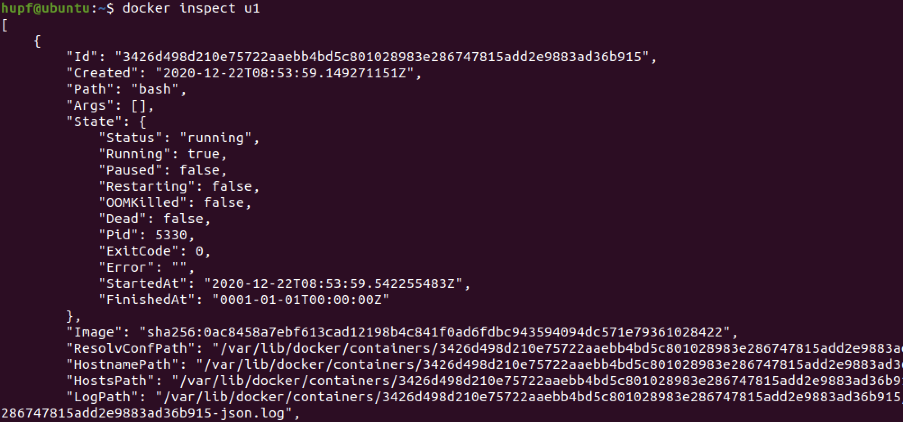

  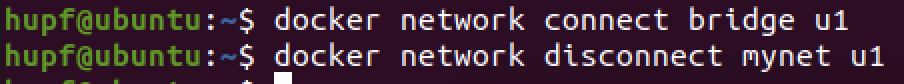

### Docker 仓库（Registry）

- 搭建私有容器仓库

  > 官方教程：https://docker.github.io/registry/deploying
  >
  > 仅需要实验到 Stop a local registry

  - 运行本地注册表

    使用如下命令启动注册表容器：

    `docker run -d -p 5000:5000 --restart=always --name registry registry:2`

    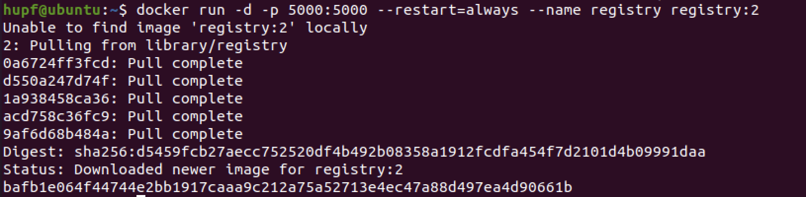

    注册表现在可以使用了。

  - 将图像从Docker Hub复制到您的注册表

    从Docker Hub中提取`ubuntu:16.04`图像。

    `docker pull ubuntu:16.04`

    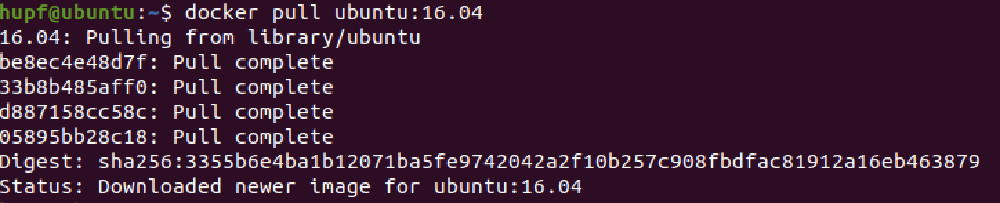

    将图像标记为`localhost:5000/my-ubuntu`。这将为现有图像创建一个附加标签。当标签的第一部分是主机名和端口时，推入时Docker会将其解释为注册表的位置：

    `docker tag ubuntu:16.04 localhost:5000/my-ubuntu`

    

    将映像推送到在以下位置运行的本地注册表`localhost:5000`：

    `docker push localhost:5000/my-ubuntu`

    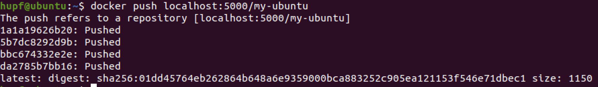

    删除本地缓存`ubuntu:16.04`和`localhost:5000/my-ubuntu` 图像，让您可以测试从注册表拉动图像。这不会`localhost:5000/my-ubuntu`从注册表中删除该图像:

    ```bash
    docker image remove ubuntu:16.04
    docker image remove localhost:5000/my-ubuntu
    ```

    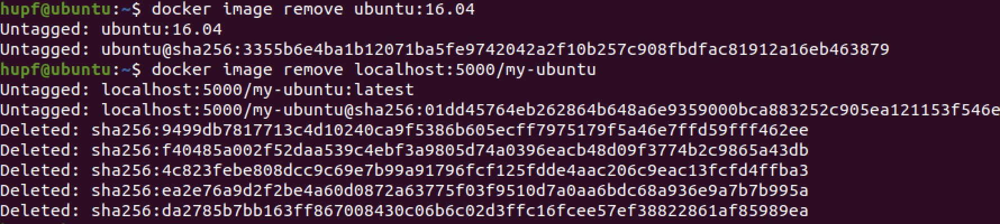

    拉`localhost:5000/my-ubuntu`从本地注册表中的形象:

    `docker pull localhost:5000/my-ubuntu`

    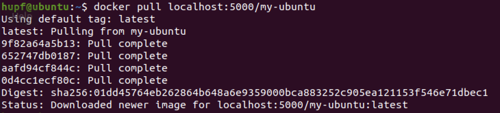

  - 停止本地注册

    要停止注册表，请使用`docker container stop`与其他任何容器相同的命令:

    `docker container stop registry`

    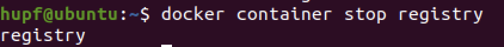

    要卸下容器，请使用`docker container rm`:

    `docker container stop registry && docker container rm -v registry`

    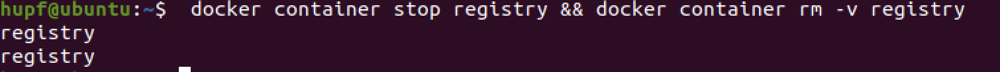

- 阿里云容器镜像服务(免费)实践

  - 访问https://cr.console.aliyun.com
  - 用淘宝或注册一个账号
  - 选择“容器镜像服务”
  - 常用仓库操作:如上传 `hello-world` 镜像
    - 登陆 `docker login --username=<your account> registry.cn-shenzhen.aliyuncs.com`
    - 标签 `docker tag hello-world registry.cn-shenzhen.aliyuncs.com/pmlpml/repo:hello- world`
    - 上传 `docker push registry.cn-shenzhen.aliyuncs.com/pmlpml/repo:hello-world`
    - 下载 `docker push registry.cn-shenzhen.aliyuncs.com/pmlpml/repo:hello-world`
    - 标签 `docker tag registry.cn-shenzhen.aliyuncs.com/pmlpml/repo:hello-world hello- world`
    - 删除 `docker rmi registry.cn-shenzhen.aliyuncs.com/pmlpml/repo:hello-world`
    - 运行 `docker run --rm hello-world`
    - 退出 `docker logout registry.cn-shenzhen.aliyuncs.com`

### 容器监控与与日志

- 检查 `docker` 的状态

  `docker info`

  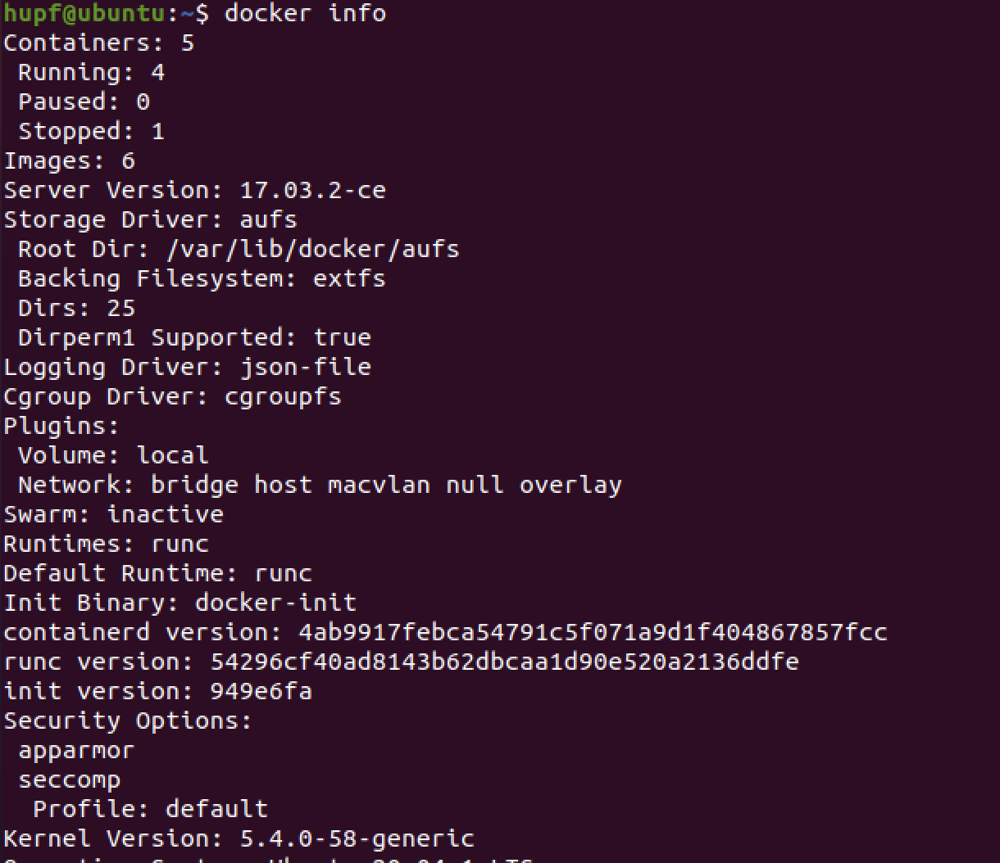

  `docker info --format {{.ServerVersion}}`

  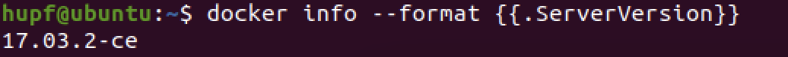

- 查看容器内进程

  `docker top`

  `docker stats`

  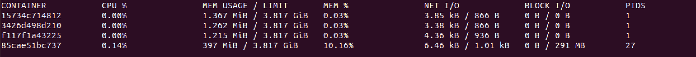

- 容器详细信息

  `docker inspect 85cae51bc737 `

  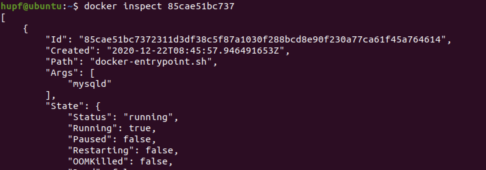

  `docker inspect -f '{{.NetworkSettings.IPAddress}}' 85cae51bc737 `

  

- 容器的日志

  > 容器应用的 `stdout` 与 `stderr` 输出

- 容器的日志查看

  `docker logs 85cae51bc737 `

  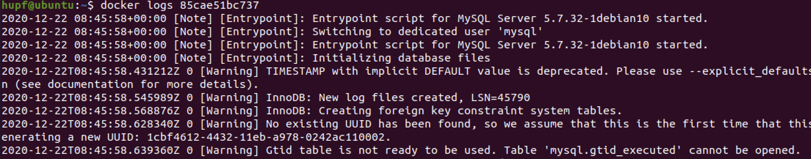

- 日志的重要性

  > 调试、分析

## 遇到问题

### 安装指定版本 Docker

如果直接按照系统提示的安装会安装最新版，所以安装指定版本需要执行以下命令：

```bash
sudo apt-get update
sudo apt-get install apt-transport-https ca-certificates curl software-properties-common
curl -fsSL https://download.docker.com/linux/ubuntu/gpg | sudo apt-key add -
sudo add-apt-repository "deb [arch=amd64] https://download.docker.com/linux/ubuntu xenial stable"
```


配置好上方的环境后通过以下命令即可查看可以安装的 `docker` 版本：

`apt-cache madison docker-ce`


然后找到指定的版本如 `社区版 17.03.2 ce`


找到之后即可在输入命令进行安装指定的版本：

`sudo apt-get install docker-ce=17.03.2~ce-0~ubuntu-xenial`


安装成功后就可以查看版本号：

`docker version`


### docker version报错

安装成功后就可以查看版本号：

`docker version`


可以看到版本号是正确的但是缺少服务端有报错信息，同样地拉取 `hello-world` 镜像也会有同样问题


所以需要添加 `docker` 用户组，用以下的命令即可：

```bash
sudo groupadd docker          #添加docker用户组
sudo gpasswd -a $XXX docker   #检测当前用户是否已经在docker用户组中，其中XXX为用户名，例如我的，liangll
sudo gpasswd -a $USER docker  #将当前用户添加至docker用户组
newgrp docker                 #更新docker用户组
```


成功配置好后，再次输入命令：

`docker version`


### 拉取镜像时报错

运行最简单的镜像 `hello-world`：

`docker run hello-world` 


可以看到虽然解决了之前的问题，但是还是会出现如下的拉取失败的问题，解决方法也是比较简单：首先进入到 `root` 用户下（这样才能修改系统文件）然后在 `/etc/resolv.conf` 文件中新增一个参数:


加完之后返回到自己的用户下重启 `docker`，再次 `pull` 就能够下载成功了


### 配置加速镜像

在运行拉取命令的时候，如果镜像比较大的话，拉取的时间会很多，所以需要进行配置镜像加速器，，直接在阿里云官网上注册得到自己的加速地址，输入一下的命令即可：

```bash
sudo mkdir -p /etc/docker
sudo tee /etc/docker/daemon.json <<-'EOF'
{
  "registry-mirrors": ["https://ou90lcbx.mirror.aliyuncs.com"]
}
EOF
sudo systemctl daemon-reload
sudo systemctl restart docker
```


`docker run -it ubuntu bash`

## 实践总结

通过本次实践熟悉了 `docker` 命令的各种操作，以及 `docker` 容器的意义；并且提高了自己对于 `ubuntu` 的操作，能够独立解决出现的问题；对于 `docker` 的优势有了更深刻的理解

