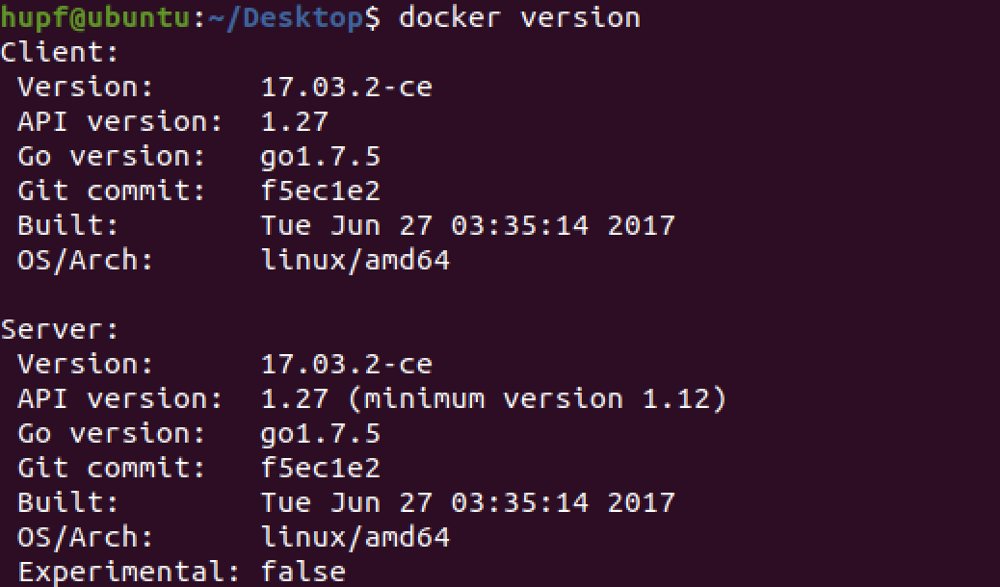
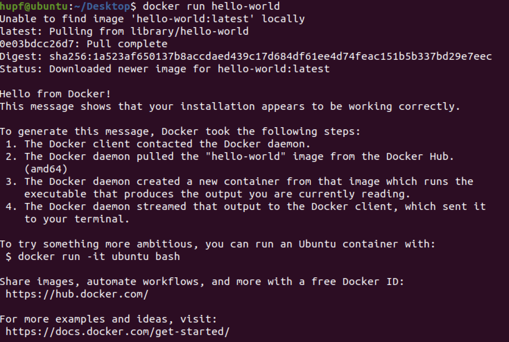

# Docker实践报告

## 个人信息

| 课程名称 |  服务计算   |   任课老师   |      潘茂林      |
| :------: | :---------: | :----------: | :--------------: |
|   年级   |   2018级    | 专业（方向） |   软件工程专业   |
|   学号   |  18342025   |     姓名     |      胡鹏飞      |
|   电话   | 13944589695 |    Email     | 945554668@qq.com |

## 实验环境

**操作系统**：`Ubuntu 64 位 20.04.1`

**docker版本**：`17.03.2-ce`

## 实践过程

### 查看是否安装docker

首先检查自己的操作系统中是否装有 `docker`，直接在命令行中输入 `docker` 即可，如果存在以下提示说明没有安装

### 准备docker环境

首先需要安装 `docker`；由于课件中写到在 `Linux` 中版本号很重要所以我选择了安装指定版本的 `docker`；如果直接按照系统提示的安装会安装最新版，所以安装指定版本需要执行以下命令：

```bash
sudo apt-get update
sudo apt-get install apt-transport-https ca-certificates curl software-properties-common
curl -fsSL https://download.docker.com/linux/ubuntu/gpg | sudo apt-key add -
sudo add-apt-repository "deb [arch=amd64] https://download.docker.com/linux/ubuntu xenial stable"
```


配置好上方的环境后通过以下命令即可查看可以安装的 `docker` 版本：

`apt-cache madison docker-ce`


然后找到老师推荐的版本 `社区版 17.03.2 ce`


找到之后即可在输入命令进行安装指定的版本：

`sudo apt-get install docker-ce=17.03.2~ce-0~ubuntu-xenial`


安装成功后就可以查看版本号：

`docker version`


可以看到版本号是正确的但是缺少服务端有报错信息，同样地拉取 `hello-world` 镜像也会有同样问题


所以需要添加 `docker` 用户组，用以下的命令即可：

```bash
sudo groupadd docker          #添加docker用户组
sudo gpasswd -a $XXX docker   #检测当前用户是否已经在docker用户组中，其中XXX为用户名，例如我的，liangll
sudo gpasswd -a $USER docker  #将当前用户添加至docker用户组
newgrp docker                 #更新docker用户组
```


成功配置好后，再次输入命令：

`docker version`



### 运行第一个容器

首先运行最简单的镜像 `hello-world`：

`docker run hello-world` 


可以看到虽然解决了之前的问题，但是还是会出现如下的拉取失败的问题，解决方法也是比较简单：首先进入到 `root` 用户下（这样才能修改系统文件）然后在 `/etc/resolv.conf` 文件中新增一个参数:


加完之后返回到自己的用户下重启 `docker`，再次 `pull` 就能够下载成功了





## 遇到问题

## 实践总结

